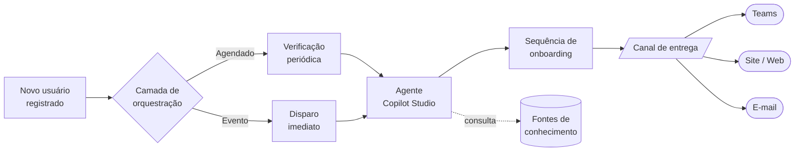
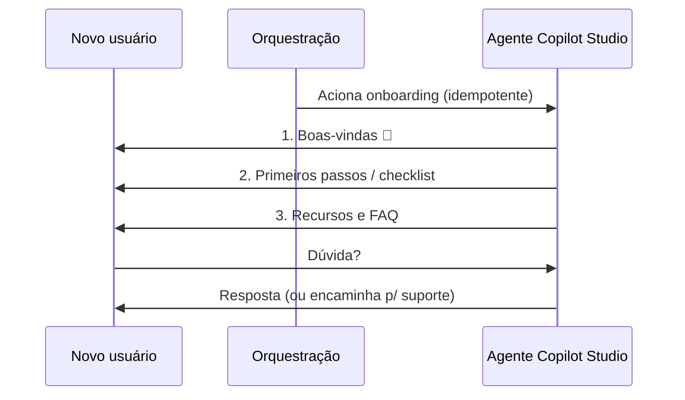

# Copilot Studio – Agente de Onboarding Automático

Template **genérico e reutilizável** para disparar mensagens de **onboarding** automaticamente por meio de um agente do **Microsoft Copilot Studio**.

Este repositório é **agnóstico de organização**: não contém dados, credenciais, endpoints ou processos de nenhuma empresa específica. Use-o como ponto de partida para construir seu próprio fluxo de boas-vindas.

## 🎯 Objetivo

Quando um novo usuário entra (novo colaborador, novo cliente, novo membro de comunidade), o agente envia uma **sequência de mensagens de boas-vindas** — apresentando recursos, coletando informações iniciais e respondendo dúvidas comuns — sem intervenção manual.

## 🧩 Como funciona (visão geral)

### Sequência de mensagens

No Copilot Studio você descreve com suas próprias palavras o que quer que o agente faça, e a IA gera nome, descrição, instruções e sugere gatilhos, canais, fontes de conhecimento e ferramentas.

## 📚 Documentação

| Documento | Conteúdo |
|-----------|----------|
| [`docs/01-arquitetura.md`](docs/01-arquitetura.md) | Componentes e fluxo do disparo automático |
| [`docs/02-gatilhos-e-automacao.md`](docs/02-gatilhos-e-automacao.md) | Tipos de gatilho (agendado x evento) e boas práticas |
| [`docs/03-mensagens-onboarding.md`](docs/03-mensagens-onboarding.md) | Estrutura e exemplos de sequência de mensagens |
| [`docs/04-seguranca-e-privacidade.md`](docs/04-seguranca-e-privacidade.md) | Autenticação, segredos e dados sensíveis |
| [`docs/05-publicacao-por-canal.md`](docs/05-publicacao-por-canal.md) | Como publicar o agente em Teams, site e demonstração |
| [`templates/onboarding-sequence.example.json`](templates/onboarding-sequence.example.json) | Exemplo de configuração de sequência (fictício) |

## 🚀 Primeiros passos

1. Crie um agente no Copilot Studio descrevendo seu objetivo de onboarding.
2. Defina a **mensagem introdutória** (boas-vindas) — veja [`docs/03-mensagens-onboarding.md`](docs/03-mensagens-onboarding.md).
3. Configure o **gatilho** de disparo — veja [`docs/02-gatilhos-e-automacao.md`](docs/02-gatilhos-e-automacao.md).
4. Conecte fontes de conhecimento (FAQ, guias públicos).
5. Teste no chat de teste e **publique** em um canal — veja [`docs/05-publicacao-por-canal.md`](docs/05-publicacao-por-canal.md).

## ⚠️ Escopo e isenção

Este material é **educativo e genérico**. Ajuste-o à realidade e às políticas da sua organização. Não inclua segredos ou dados confidenciais em prompts ou neste repositório.

## Licença

MIT
